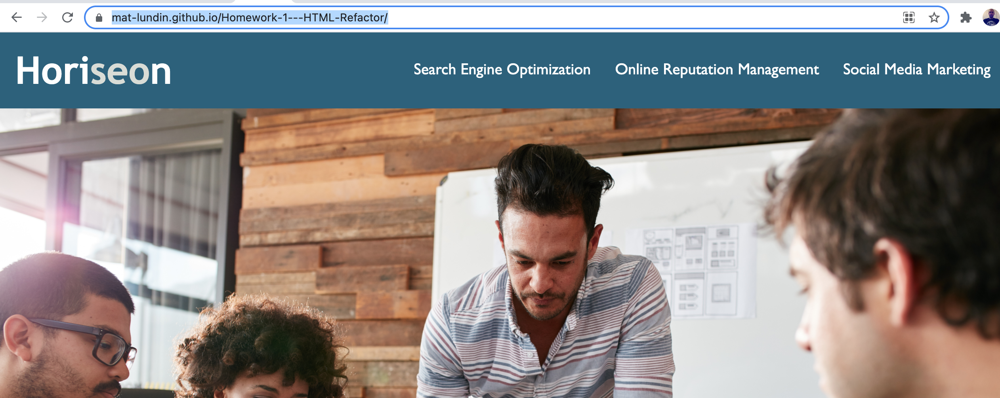

# Homework-1---HTML-Refactor
The objective for this project was the increase the accessibility of the web page, while leaving its functionality and appearance as it was before.

## What was done
To accomplish this, I removed all of the ``

`` tags and replaced them with semantic elements that fit the design of the page.
I also added alt text to the images, including using a ``<figure></figure>`` element for the background image, since that image was actually linked in the CSS file.
Lastly, there were multiple instances of redundant CSS. These have been consolidated into one class per style.

## Updated version of the webpage
The updated version is hosted on my github and can be found [here](https://mat-lundin.github.io/Homework-1---HTML-Refactor/)

